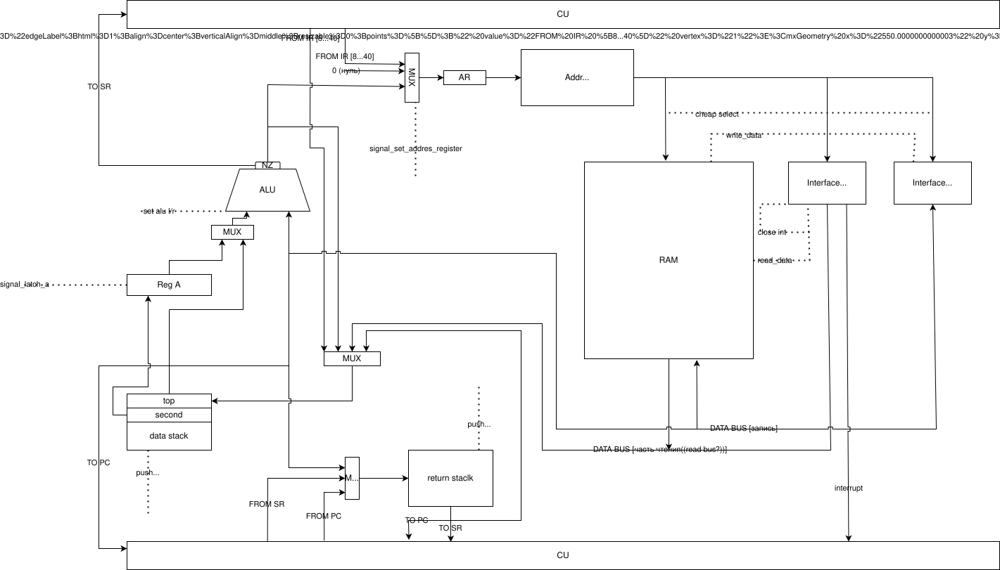
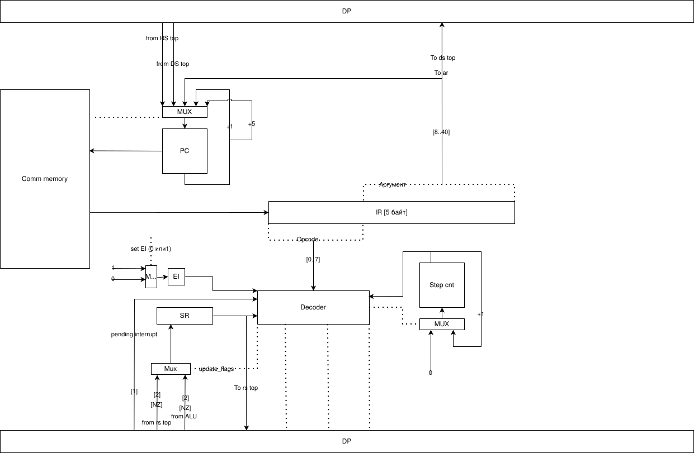

# Лабораторная работа №4. Эксперимент

> [!TIP]
> «1 такт - 1 защёлкивание регистра. Это как народ и фюрер.» 
> - (с) Александр Владимирович Пенской


---

- ФИО: Чайковский Никита Михайлович
- Группа: P3217
- Вариант: `alg | stack | harv | hw | tick | binary | trap | mem | cstr | prob1 | - `

## Оглавление
1. [Язык программирования](#язык-программирования)
2. [Схемы](#картинки)
3. [Организация памяти и аппаратных стеков](#организация-памяти-и-аппаратных-стеков)
4. [Система команд (ISA)](#система-команд-isa)
5. [Ввод-вывод и система прерываний (Trap)](#ввод-вывод-и-система-прерываний-trap)
6. [Транслятор](#транслятор)
7. [Модель процессора](#модель-процессора)
8. [Руководство пользователя (Интерфейс командной строки)](#руководство-пользователя-интерфейс-командной-строки)
9. [Тестирование и CI](#тестирование-и-ci)

---

## Язык программирования

Синтаксис языка является алгоритмическим (C/Java-подобным), специально спроектированным для удобной трансляции в низкоуровневую стековую архитектуру. Язык строго последовательный, поддерживает работу с глобальными переменными, циклами, ветвлениями и косвенной адресацией (указателями).

### Синтаксис (BNF)

```ebnf
<программа> ::= [ <обработчик_прерывания> ] <точка_входа>

<обработчик_прерывания> ::= "trap" <идентификатор> ";" <тело_программы> "trap-end" ";"
<точка_входа> ::= "main" ";" <тело_программы> "main-end" ";"

<тело_программы> ::= { <оператор> }

<оператор> ::= <объявление_переменной> 
             | <присваивание> 
             | <условие> 
             | <цикл_while> 
             | <цикл_for> 
             | <ввод_вывод> 
             | <управление_прерываниями>

<объявление_переменной> ::= <тип> <идентификатор> "=" <выражение> ";"
<присваивание> ::= <идентификатор> "=" <выражение> ";"

<условие> ::= "if" "(" <логическое_выражение> ")" ";" <тело_программы> "if-end" ";"
<цикл_while> ::= "while" "(" <логическое_выражение> ")" ";" <тело_программы> "while-end" ";"
<цикл_for> ::= "for" "(" <объявление_переменной> "," <логическое_выражение> "," <присваивание> ")" ";" <тело_программы> "for-end" ";"

<ввод_вывод> ::= 
               | "пиши_строку" "(" <выражение> ")" ";"
               | "пиши_память" "(" <выражение> ")"
               | "читай_память()" ";"

<управление_прерываниями> ::= "ei" ";" | "di" ";"

<логическое_выражение> ::= <выражение> <оператор_сравнения> <выражение>
<оператор_сравнения> ::= "==" | "<" | ">"

<выражение> ::= <терм> { <арифметический_оператор> <терм> }
<терм> ::= <число> 
         | <идентификатор> 
         | <строковый_литерал> 
         | "пиши_адрес" "(" <идентификатор> "," <выражение> ")" ";" 
         | "читай_адрес(" <идентификатор> ")"

<арифметический_оператор> ::= "+" | "-" | "*" | ":" | "%" | "&"

<тип> ::= "цело" | "грамота"
<число> ::= [-2^31; 2^31 - 1]
<строковый_литерал> ::= '"' { <любой_символ> } '"'
```

### Семантика
- **Глобальная область видимости**: Все переменные и константы статически размещаются в Data Memory при компиляции программы. Отсутствует понятие локальных переменных или сборщика мусора.
- **Типы данных**: Основной тип данных - знаковое машинное слово (32 бита). Строки (тип `cstr`) сохраняются в память как непрерывные нуль-терминированные массивы символов (каждый символ занимает одно полное машинное слово).
- **Вычисление выражений**: Любые сложные инфиксные математические выражения автоматически транслируются компилятором в постфиксную запись (Обратную польскую нотацию), так как процессор не имеет регистров общего назначения и выполняет арифметику исключительно через стек.
- **Указатели и косвенная адресация**: Функции `читай_адрес(ptr)` и `пиши_адрес(ptr, val)` предоставляют программисту механизмы работы со строками и массивами на месте (in-place) посредством аппаратного регистра `A`.
- **И функции для работы с IO **: `пиши_строку`,`пиши_память`,`читай_память()`.
---
## Картинки



## Организация памяти и аппаратных стеков

Архитектура является **Гарвардской (`harv`)**. Память команд (Instruction Memory) и память данных (Data Memory) физически разнесены, имеют собственные шины и независимую адресацию.

В рамках архитектурного эксперимента в процессоре реализовано постоянное выравнивание всех хранящихся значений в памяти данных по границе машинного слова (4 байта / 32 бита). (выравнивание происходит во время трансляции)

Мотивация проектирования: ~~Моя искрення лень~~ Попытка избежать сложной логики загрузки интов для работы с ними...

Согласно варианту, один символ строки может занимать одно машинное слово. Да, ужасно, но это облегчило разработку транслятора. Строка завершается нулевым машинным словом (0x00000000).

### Ультимативная система указателей и работа со строками (`cstr`)
В рамках архитектурного эксперимента реализована полноценная поддержка косвенной адресации и указателей для работы с памятью in-place. 

Согласно варианту, строки реализованы в формате `cstr` (C-строки, оканчивающиеся нулём). Из-за выравнивания памяти по границе машинного слова (32 бита), **каждый символ занимает целые 4 байта**.
> [!NOTE]
> После записи всех строк начинается размещение указателей.
> Т.е. переменная грамота d = "Hello, World"; будет хранить начало строки в датапамяти.

Для обеспечения работы указателей `DataPath` оснащен — **Регистром А (`Reg A`)**. Его единственная жизненная цель — хранить адреса для косвенных обращений к памяти (а после их инкрементации).Раньше был страшный аналог - постоянно загружать адрес -> инкремент -> сохранение. 

На уровне языка программисту доступны элегантные функции `читай_адрес(ptr)` и `пиши_адрес(ptr, val)`. Под капотом транслятор разворачивает их в байт-код (`TOA` -> `ALOAD` / `ASTORE`). Эта система позволяет легко реализовывать алгоритмы (например, сортировку Пузырьком в `sort.alg`), абсолютно не засоряя вычислительный Data Stack "застрявшими" адресами.
Функция `пиши(строку)` разворачивается в цикл чтения и записи в соответствующую ячейку памяти (у нас MMIO ведь) до встречи 0 ((конец строки)).

### Память данных (Data Memory)
Однопортовая память. Размер машинного слова: 32 бита. Адресация: линейная, абсолютная.

| Логический Адрес | Назначение |
|------------------|------------|
| `0x0000` | **Вектор прерывания** (Здесь транслятор сохраняет адрес начала функции `trap`). |
| `0x0001` ... `0x7CFD` | Глобальные переменные, инициализированные массивы и статические строковые литералы. |
| `0x7CFE (31998)` | **Порт ввода** (Memory-Mapped I/O). |
| `0x7CFF (31999)` | **Порт вывода** (Memory-Mapped I/O). |

### Организация аппаратных стеков (`stack`)
В отличие от классической фон-неймановской архитектуры, где стек выделяется в общей оперативной памяти, в данной модели **стеки вынесены в полностью независимые изолированные устройства памяти (отдельные RAM-блоки)**:

- **Data Stack (DS)**: Аппаратный массив на 256 слов (по 32 бита). Предназначен для хранения операндов АЛУ. Прямого доступа по адресу не имеет. Управляется исключительно аппаратным счётчиком-указателем `DSP` через интерфейсы PUSH/POP.
- **Return Stack (RS)**: Аппаратный массив на 256 слов (по 32 бита). Предназначен для сохранения адресов возврата (`PC`) и контекста исполнения (регистр состояний `SR`) при аппаратных прерываниях. Управляется аппаратным счётчиком `RSP`.

---

## Система команд (ISA)

Устройство управления - **Hardwired (`hw`)**. Процессор моделируется с точностью до такта (`tick`). Машинный код представляет собой чистые бинарные данные (`binary`).

### Кодирование инструкций
Команды сериализуются в Big-Endian формате:
- Инструкция без аргумента занимает **1 байт** (чистый опкод).
- Инструкция с аргументом занимает **5 байт** (1 байт опкод + 4 байта аргумент).

### Полный набор команд

| Опкод | Мнемоника | Арг? | Такты | Описание |
|-------|-----------|------|-------|----------|
| **Арифметика и логика (АЛУ работает с вершиной Data Stack)** |
| `0x00`| `INC` | Нет | 2 | Инкремент вершины стека |
| `0x01`| `DEC` | Нет | 2 | Декремент вершины стека |
| `0x03`| `ADD` | Нет | 2 | Сложить два верхних значения `DS` |
| `0x02`| `SUB` | Нет | 2 | Вычесть (Top - Second) |
| `0x04`| `MUL` | Нет | 2 | Умножить два верхних значения |
| `0x05`| `DIV` | Нет | 2 | Целочисленное деление |
| `0x26`| `MOD` | Нет | 2 | Остаток от деления |
| `0x12`| `INV` | Нет | 2 | Побитовая инверсия (`NOT`) |
| `0x13`| `AND` | Нет | 2 | Побитовое `AND` |
| `0x14`| `XOR` | Нет | 2 | Побитовое `XOR` |
| `0x15`| `OR`  | Нет | 2 | Побитовое `OR` |
| `0x10`| `LSHIFT`| Нет | 2 | Битовый сдвиг влево |
| `0x11`| `RSHIFT`| Нет | 2 | Битовый сдвиг вправо |
| **Работа со стеком данных (Data Stack)** |
| `0x06`| `LIT` | Да (4b)| 1 | Загрузить 32-битную константу на `DS` |
| `0x16`| `DROP`| Нет | 1 | Удалить вершину `DS` |
| `0x17`| `DUP` | Нет | 1 | Дублировать вершину `DS` |
| `0x18`| `OVER`| Нет | 1 | Поменять местами два верхних элемента |
| **Прямая адресация памяти данных** |
| `0x0F`| `LOAD`| Да (4b)| 2 | Прочитать значение по статическому адресу в `DS` |
| `0x1F`| `STORE`| Да (4b)| 2 | Записать значение с `DS` по статическому адресу |
| **Косвенная адресация (через Address Buffer Register A)** |
| `0x07`| `TOA` | Нет | 1 | Снять значение с `DS` и записать в `Reg A` |
| `0x09`| `TOSTACKFROMA`| Нет| 1| Положить копию значения из `Reg A` на `DS` |
| `0x0E`| `ALOAD`| Нет | 2 | Чтение из памяти по адресу, лежащему в `Reg A` |
| `0x21`| `ALOADP`| Нет | 3 | Косвенное чтение из памяти с постинкрементом адреса в `Reg A` |
| `0x0C`| `ASTORE`| Нет | 2 | Косвенная запись вершины `DS` по адресу в `Reg A` |
| **Поток управления (Условные и безусловные переходы)** |
| `0x20`| `JMP` | Да (4b)| 1 | Безусловный переход на адрес в Instruction Memory |
| `0x1B`| `IF`  | Да (4b)| 2 | Jump if Zero (переход если `DS.pop() == 0`) |
| `0x1C`| `MIF` | Да (4b)| 2 | Jump if Negative (переход если `DS.pop() < 0`) |
| `0x25`| `NIF` | Да (4b)| 2 | Jump if Not Zero (переход если `DS.pop() != 0`) |
| **Аппаратные прерывания (Trap)** |
| `0x23`| `EI`  | Нет | 1 | Разрешить прерывания (Enable Interrupts) |
| `0x24`| `DI`  | Нет | 1 | Запретить прерывания (Disable Interrupts) |
| `0x22`| `IRET`| Нет | 2 | Возврат из прерывания (Восстановить `SR` и `PC` из `RS`) |
| **Остановка** |
| `0xFF`| `HALT`| Нет | 1 | Остановка работы ControlUnit |

*АЛУ выставляет флаги `N` (Negative) и `Z` (Zero) на каждой математической операции. При выставлении значения защелок объединяются и отправляются в регистр состояний (SR).*

---

## Ввод-вывод и система прерываний (Trap)

Система построена на принципах так называемого **реализма**. Ввод-вывод является асинхронным и работает через **внутренние прерывания (`trap`)** и порты **Memory-Mapped I/O (`mem`)**.

### Логика работы ввода-вывода
1. **Ввод по таймеру (Внешнее устройство)**: Внешняя клавиатура/устройство эмулируется текстовым файлом расписания. Расписание состоит из пар `[такт] [ASCII-код]`.
2. В заданный такт таймер "выставляет" числовое значение символа напрямую на порт ввода (`31998`) и выставляет сигнал `pending_interrupt`. 
3. **Отсутствие магических очередей**: В системе нет программных буферов ввода. Если прерывания запрещены, или программа не успела прочитать символ из порта до прихода следующего, **старый символ безвозвратно затирается новым**. Это заставляет программиста корректно настраивать тайминги или крутиться в пустом `while`-цикле ожидания.

### Аппаратный вход в прерывание 
В 0 ячейке памяти команд лежит адрес, с которого начинается обработчик прерывания. Это сделано, т.к. в некоторых программах у меня есть глобальные переменные (**которые должны были объявляться до обработчика**). Поэтому, транслятор запоминает еще и адрес обработчика.

> [!NOTE]
> Так называемый вектор прерывания.
> ฅ^•ﻌ•^ฅ 

Между выполнением команд `ControlUnit` проверяет состояние флага глобального разрешения прерываний (`IE == 1`) и сигнала `pending_interrupt`. 
Если прерывание получено, процессор **сбрасывает флаг `IE` в 0** (прерывания внутри прерываний невозможны для избежания порчи стека) и выполняет аппаратную микропрограмму смены контекста за **5 физических тактов**:
- `Такт 0`: `ReturnStack <- PC` (сохранение счетчика текущей команды).
- `Такт 1`: `ReturnStack <- SR` (сохранение регистра флагов АЛУ).
- `Такт 2`: `AddressRegister <- 0` (выставление 0 на шину адреса Data Memory).
- `Такт 3`: `DataStack <- DataMemory[AR]` (загрузка заранее подготовленного вектора прерывания на стек данных).
- `Такт 4`: `PC <- DataStack.pop()` (перенос вектора в счетчик команд и прыжок).

Наличие прерываний проверяется только после выполнения команды. (Или перед началом следующей, без разницы, я считаю)

> [!IMPORTANT]
> Почему так?
> Из-за наличия команды aloadp (3 такта). В текущей реализации прерываний решено не сохранять шаг команды. 
> Т.е. после прерывания проц продолжит с начала команды (step = 0), на которой остановился.
> Если мы позволим прерываться во время команды. То в случае прерывания aloadp оставит в стеке значение...И никогда его не вытащит
> Своего рода утечка памяти.

### Возврат из прерывания (`IRET`)
Инструкция `IRET` за 2 такта восстанавливает контекст:
1. Восстанавливает флаги `N` и `Z` из Return Stack.
2. Восстанавливает старый `PC` из Return Stack и аппаратно поднимает глобальный флаг разрешения прерываний (`IE = 1`).

---

## Транслятор

Транслятор `translator.py` представляет собой накостыленный компилятор. 

> [!CAUTION]
> В нем все настолько плохо, что он умеет читать только выражения вида ( 1+ 2 * 3 )
> (1+2*3) просто не пройдут
> Зато работает
> (ㅠ﹏ㅠ)

- Математические выражения парсятся с учетом приоритета операций (скобки, умножение/деление, сложение/вычитание), преобразуются в структуру **Абстрактного Синтаксического Дерева (AST)**.
- **AST** строится не только для математики, но и для блоков программ.
- Разрешение адресов для условных переходов (`if`, `while`) осуществляется методом "Залез в готовый код и подправил, где надо, адреса" : генератор временно оставляет в байт-коде строковую заглушку `<if-end-ID>`, которая заменяется на рассчитанный абсолютный адрес памяти после обработки вложенного блока.
- Вывод транслятора сохраняется в папку `compiled/`. Для отладки компилятор рисует файл с текстовым представлением байтовых команд (см compiled/*имя*_test.txt)
- формирует конфиг для запуска процессора. В конфиге у нас. Стартовое значение PC. Размеры памяти. Зарезервированные ячейки памяти под ввод-вывод.(и, благодаря Гарвардской архитектуре, указания, какой должна быть датапамять)
- 
---

## Модель процессора

Процессор реализован в `machine.py`.
- **DataPath**: Изолированная модель передачи данных. Содержит АЛУ, регистр A (как address buffer (больше у него нет никакой цели)), кучу мультиплексоров и строго фиксированные по размеру `stack` и `return_stack`. Вырезан регистр B (который был в вренчевской f32) за ненадобностью (АЛУ работает напрямую с вершинами Data Stack).
- **ControlUnit**: ... Выполняет инструкции по шагам `self.step`. Обновляет глобальный счетчик тактов `self._tick`. Отслеживает прерывания. Ну и вообще много чего делает.
- Логгирование (журнал тактов) ограничено первыми 100 тактами, чтобы предотвратить создание гигантских файлов при выполнении ресурсоемких алгоритмов.

---

## Руководство пользователя (Интерфейс командной строки)

Для удобства использования реализовано интерактивное консольное меню в `translator.py`.

### Использование транслятора
Запустите скрипт без аргументов для перехода в интерактивный режим:
```bash
python translator.py
```
Скрипт предложит выбор:
```text
+++ ЗАПУСК ПРОЦЕДУРЫ ТРАНСЛЯЦИИ В БИНАРНЫЙ ГИМН +++
%ВЫБОР ПРОЦЕДУРЫ%
1 // [ТРАНСЛЯЦИЯ И ЗАПУСК]
2 // [ФОРМИРОВАНИЕ ОЧЕРЕДИ ВВОДА]
```

#### Режим 1: Трансляция и симуляция
Выполняет полный цикл сборки и запуска программы.
Вы должны передать имя файла через аргумент командной строки (без расширения `.txt`) ((иначе не заработает)):
```bash
python translator.py examples/hello_world
```
Все артефакты компиляции (бинарный файл `.bin`, конфигурация `.json`, расписание и дебаг-лог) будут сохранены в директорию `compiled/`.

#### Режим 2: Формирование расписания прерываний (Schedule)
Так как процессор получает данные через аппаратные прерывания, ввод пользователя должен быть эмулирован. Режим `2` запрашивает у вас строку текста и автоматически генерирует файл `shedule.txt`, распределяя символы (их ASCII-коды) с фиксированным шагом по времени. 

Пример сгенерированного расписания:
```text
40 65   // Такт 40: символ 'A' (ASCII 65)
80 108  // Такт 80: символ 'l' (ASCII 108)
120 105 // Такт 120: символ 'i' (ASCII 105)
160 10  // Такт 160: символ '\n' (ASCII 10) - Маркер конца строки
```

### Прямой запуск процессора
Для отладки можно запустить процессор напрямую, передав ему сгенерированные файлы:
```bash
python machine.py compiled/cat.bin compiled/cat_shedule.txt compiled/cat_config.json
```

---

## Тестирование и CI

Тестирование (`golden tests`) реализовано с помощью фреймворка `pytest` в файле `tests/test_integration.py`. 
Скрипт автоматически ищет файлы в папке `examples/`, компилирует их, симулирует ввод пользователя (если есть файл `<name>_in.txt`) и сохраняет **монолитный** отчет в формат `YAML`. 

Эталонный `.yml` файл содержит:
1. Исходный код программы.
2. Имитированный ввод пользователя.
3. Полный лог работы: человекочитаемое AST-дерево, дамп байт-кода, журнал первых 100 тактов моделирования, финальный буфер вывода и снимок памяти данных.

Для запуска тестов:
```bash
pytest tests/test_integration.py -v
```

### Алгоритмы:
1. **hello_world**: Простой вывод строки. Использует `DI` (запрет прерываний).
2. **cat**: Посимвольное чтение данных через порт ввода внутри обработчика прерываний по таймеру и вывод их обратно на экран. В основной программе крутится пустой `while`.
3. **hello_user**: Интерактивный запрос имени. Процессор выводит приглашение, ожидает прерываний от клавиатуры и собирает имя.
4. **sort**: Сортировка массива алгоритмом "Пузырёк". Демонстрирует работу с указателями и массивами в Data Memory через косвенные инструкции `ALOAD` и `ASTORE`.
5. **math64**: Программная эмуляция арифметики двойной точности (64 бита) на 32-битной архитектуре (через ручной перенос бита carry).
6. **prob1** (Euler 4 - Палиндром): Математический алгоритм поиска самого большого палиндрома, полученного умножением трехзначных чисел (999 * 999). Алгоритм максимально оптимизирован, не осуществляет пересчёт уже проверенных малых множителей. Выполняется полностью аппаратно за секунды **(я молодец)**.

